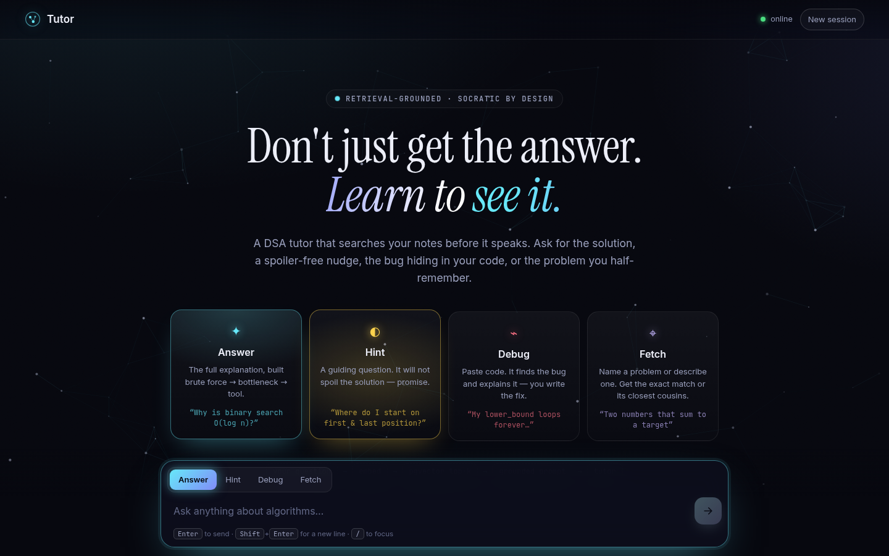
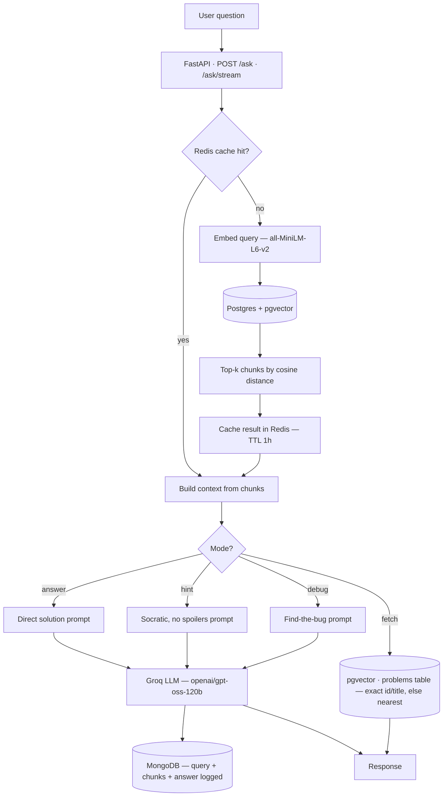
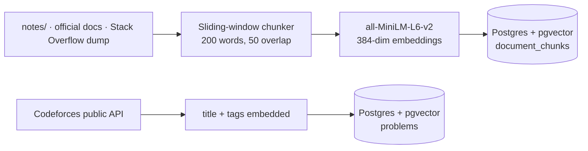
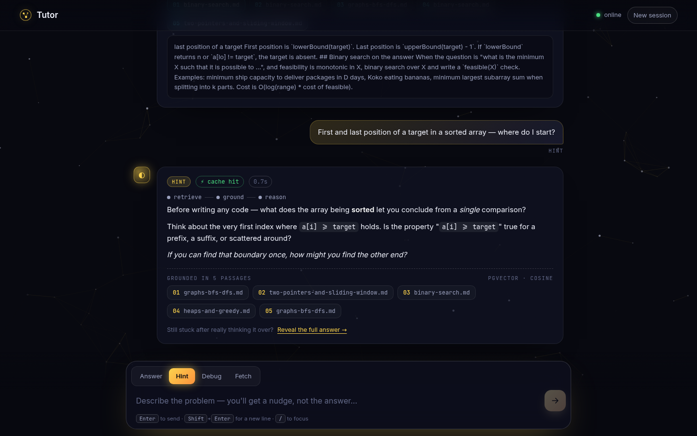

# Tutor

**A self-hosted, RAG-grounded DSA tutor — API and web app.** Ask it a DSA question and it doesn't just answer — it can also give you a Socratic hint that never spoils the solution, find the bug in your pasted code, or surface the exact problem you're thinking of, all grounded in retrieved context instead of pure LLM guesswork.

**▶ Try it live: [tutor.lucifer07o.tech](https://tutor.lucifer07o.tech)**




-F55036)

---

## Why this exists

Most "chat with your docs" demos stop at Q&A. This one is built specifically as a **DSA tutor that teaches instead of just answering** — the same brute-force → bottleneck → tool framework used to actually learn algorithms, not a shortcut around it. Ask it to *solve* your problem and you get an answer. Ask it for a *hint* and it deliberately withholds the solution, points you toward the idea, and asks a guiding question instead — the retrieval and the LLM call are identical, only the system prompt changes.

Built from zero prior Docker/RAG knowledge, ground-up: containers, vector search, caching, and three separate databases each doing exactly one job.

## How a query flows



**Offline, before any of this runs:** notes get chunked and embedded once, ahead of time.



## The four modes

| Mode | What it does | Rule it follows |
|---|---|---|
| `answer` | Direct, complete solution | Uses retrieved context; falls back to model knowledge, but stays consistent with the brute-force → bottleneck → tool framework |
| `hint` | Points at the right idea without giving it away | Never names functions/files from context, never gives step-by-step directions, prefers a guiding question over a stated fact |
| `debug` | Locates the bug in your pasted code | Explains what's wrong — does not rewrite the whole solution for you |
| `fetch` | Surfaces the exact indexed problem, or the most similar ones | Exact match on problem id (`1850A`, `CF 4A`) or title first, then nearest neighbours by embedding. No LLM call. |

The three LLM modes share the same retrieval pipeline; only the system prompt sent to the LLM changes. `fetch` searches a separate `problems` table instead of the notes.

## Why three databases instead of one

| Store | Job | Why not just use Postgres for everything |
|---|---|---|
| **Postgres + pgvector** | Source of truth for chunk text + embeddings, nearest-neighbor search | It's the only one that needs to |
| **Redis** | Cache `query → top-k chunks` for 1 hour | A repeated question shouldn't re-embed and re-search every time — a single key lookup instead of an embedding model call + vector search |
| **MongoDB** | Log every query, its retrieved chunks, mode, and final answer | Logs are unstructured/append-only and never joined against the relational data — no reason to force them into Postgres |

Redis and MongoDB are both optional at runtime: if Redis is down, retrieval just skips the cache; if MongoDB is down, logging is dropped with a warning (it runs on a background thread, so it never adds latency either).

## Quickstart

```bash
git clone https://github.com/Nitingupta0/Tutor.git
cd Tutor

python -m venv venv
venv\Scripts\activate        # Windows — use `source venv/bin/activate` on macOS/Linux
pip install -r requirements.txt

cp .env.example .env         # then add your GROQ_API_KEY (https://console.groq.com) and pick a POSTGRES_PASSWORD

docker compose up -d         # Postgres+pgvector, Redis, MongoDB

python ingest.py             # chunk + embed the bundled notes/ into pgvector (creates the schema)
python -m corpus.codeforces  # optional: index the Codeforces problemset for `fetch` mode

uvicorn main:app --reload    # open http://127.0.0.1:8000
```

## The web app

`uvicorn` serves a single-page app at `/` — no build step, just `static/`.

- **Four modes, one composer.** The whole interface re-tints per mode (cyan answer, amber hint, rose debug, violet fetch).
- **Streams token by token** over server-sent events, with a live `retrieve → ground → reason` progress trail.
- **Grounded, not leaky.** Each answer notes how many passages it was grounded in, but never which files. Your notes stay internal, and the LLM is told not to cite them either. (Full sources are still logged to MongoDB for debugging.)
- **Knowledge constellation.** The background is a field of "chunks"; each question drops a probe that locks onto its top-k neighbours, mirroring the vector search running on the server.
- **Hint mode keeps its promise** — the full answer is one deliberate click away ("Reveal the full answer"), never the default.
- `fetch` results link to the problem, with its rating and a similarity meter. Debug mode switches the input to monospace and `Ctrl+Enter` to send, so pasting code is painless.



## Growing the corpus

Everything goes through `ingest.py`, which accepts any folder of `.md`, `.txt` or `.rst` files. `--append` adds to the index instead of rebuilding it; re-ingesting a file replaces its old chunks.

| Source | Command | Lands in |
|---|---|---|
| Bundled notes (`notes/`) | `python ingest.py` | `document_chunks` |
| Official docs (e.g. the CPython `Doc/` folder, cppreference offline archive) | `python ingest.py path/to/docs --append` | `document_chunks` |
| Stack Overflow data dump (CC BY-SA, [archive.org](https://archive.org/details/stackexchange)) | `python -m corpus.stackoverflow Posts.xml --out corpus_out/so --min-score 10`<br>`python ingest.py corpus_out/so --append` | `document_chunks` |
| Codeforces problemset ([public API](https://codeforces.com/apiHelp)) | `python -m corpus.codeforces --min-rating 800 --max-rating 2000` | `problems` |

The Stack Overflow importer streams the XML, so the multi-GB dump never has to fit in memory. It keeps questions with an accepted answer, a matching tag, and a minimum score, and writes each one as a Markdown note that links back to the question and carries its license. The Codeforces importer stores metadata only (id, title, tags, rating and a link to the statement), which is all `fetch` needs.

## Using the API

| Endpoint | Returns |
|---|---|
| `POST /ask` | `{"mode", "answer", "passages", "cached"}` — or `{"mode": "fetch", "problems": [...]}` |
| `POST /ask/stream` | Server-sent events: `grounding` → `token`… → `done` (or `problems` → `done`; `error` on failure) |
| `GET /health` | `{"status": "ok"}` |
| `GET /docs` | Interactive OpenAPI docs |

Request body: `{"question": str, "mode": "answer" | "hint" | "debug" | "fetch"}`. An unknown mode gets a `422`, and a missing `GROQ_API_KEY` gets a `503` with a clear message.

```bash
curl -X POST http://127.0.0.1:8000/ask \
  -H "Content-Type: application/json" \
  -d '{"question": "What is binary search?", "mode": "answer"}'

curl -X POST http://127.0.0.1:8000/ask \
  -H "Content-Type: application/json" \
  -d '{"question": "CF 4A", "mode": "fetch"}'
```

```python
import requests

response = requests.post("http://127.0.0.1:8000/ask", json={
    "question": "I need to find the first and last position of a target in a sorted array. Where should I start?",
    "mode": "hint",
})
print(response.json()["answer"])
```

## Project structure

```
Tutor/
├── main.py                 # FastAPI app — /ask, /ask/stream, /health, serves the UI
├── generate.py             # Builds context, holds the 3 mode prompts, calls Groq (blocking + streaming)
├── retrieve.py             # Query → Redis cache → embed → pgvector nearest-neighbour
├── problems.py             # `fetch` mode — exact id/title match, then similar problems
├── ingest.py               # Offline pipeline: docs → chunks → embeddings → pgvector
├── embed.py                # Embedding model, loaded once per process
├── db.py                   # Postgres connection + schema (document_chunks, problems)
├── log.py                  # Background MongoDB query logging
├── config.py               # All settings, from env / .env
├── corpus/
│   ├── codeforces.py       # Codeforces API → problems table
│   └── stackoverflow.py    # Stack Exchange dump → Markdown notes
├── notes/                  # Bundled seed notes (brute force → bottleneck → tool)
├── static/                 # Web app: index.html, app.css, app.js, constellation.js
├── tests/                  # pytest suite — no databases, model or API key needed
├── scripts/
│   ├── setup-server.sh     # one-time server setup (Docker, swap, .env, start, index)
│   ├── update.sh           # pull + rebuild + restart on the server
│   └── smoke_test.py, scratch_embed.py
├── .github/workflows/
│   ├── ci.yml              # lint + tests on every PR
│   └── deploy-server.yml   # optional: updates the server on every merge to main
├── Dockerfile              # app image
├── docker-compose.prod.yml # production stack: app, Postgres, Redis, MongoDB, Caddy (HTTPS)
├── Caddyfile               # HTTPS + reverse proxy
├── DEPLOY.md               # deployment guide (any Ubuntu server)
├── docker-compose.yml      # local Postgres+pgvector, Redis, MongoDB
├── requirements.txt / requirements-dev.txt
└── .env.example
```

## Development

```bash
pip install -r requirements-dev.txt
ruff check .
pytest
```

The tests stub out Postgres, Redis, MongoDB, Groq and the embedding model, so they run in a few seconds with no services up. CI runs lint and tests on every push to `main` and every pull request.

## Deployment

Runs on a single Linux server with Docker Compose. The live demo runs on an Azure `Standard_B2als_v2` (Ubuntu 24.04, 4 GB RAM); other providers and sizes should work the same way. `docker-compose.prod.yml` runs the app, Postgres + pgvector, Redis, MongoDB, and **Caddy**, which issues HTTPS certificates automatically. The stack publishes only ports 80/443; the databases stay on Docker's private network. `scripts/setup-server.sh` provisions a fresh server in one command and generates the database password on the server. `.github/workflows/deploy-server.yml` can update the server on every merge to `main`. Visitors are limited to 20 questions a minute (`RATE_LIMIT_PER_MINUTE`) to protect the LLM quota.

The app also accepts a single `DATABASE_URL` (e.g. a hosted Postgres such as Neon), and Redis/MongoDB can be switched off with empty URLs, for lighter hosting setups.

Deployment guide: **[DEPLOY.md](DEPLOY.md)**.

## Status & roadmap

- [x] Ingestion pipeline (chunk → embed → store)
- [x] Retrieval API (embed → vector search → top-k)
- [x] Redis caching with TTL
- [x] LLM integration — 3 intent-aware modes (answer / hint / debug)
- [x] MongoDB query logging
- [x] FastAPI REST wrapper
- [x] Corpus expansion — bundled notes, official-docs loader, Codeforces public API, Stack Overflow dump
- [x] `fetch` mode — surface the exact/similar indexed problem
- [x] CI (lint + test on PR)
- [x] Web frontend — streaming, grounded answers, four modes
- [x] Deployment — Docker Compose + Caddy (HTTPS), one-command provisioning, auto-deploy on merge, per-visitor rate limit
- [x] Public deployment live: **[tutor.lucifer07o.tech](https://tutor.lucifer07o.tech)**

Built with corpus sourced only from this project's own notes and license-clean sources — deliberately **not** scraping GeeksforGeeks or LeetCode, since both prohibit it in their ToS.
