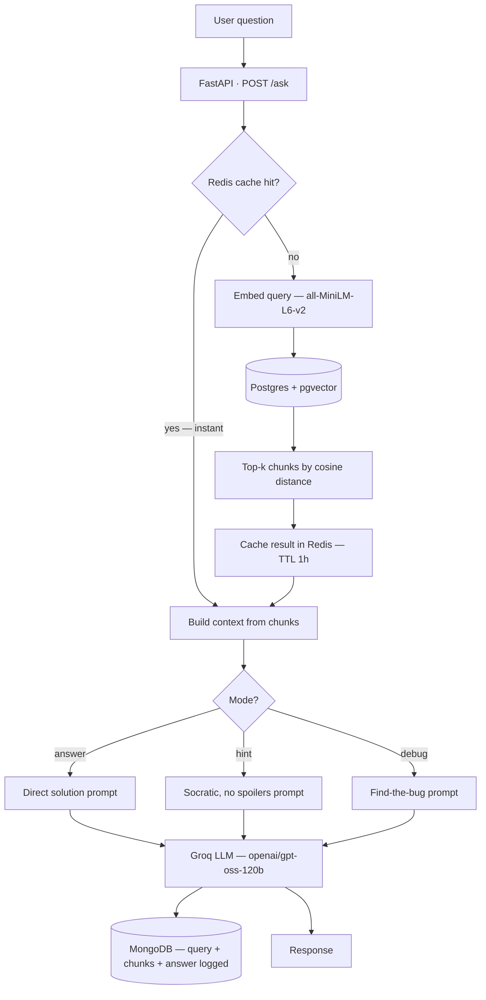
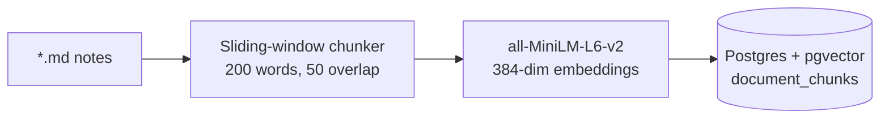

# Tutor

**A self-hosted, RAG-grounded technical tutoring API.** Ask it a DSA question and it doesn't just answer — it can also give you a Socratic hint that never spoils the solution, or find the bug in your pasted code, all grounded in retrieved context instead of pure LLM guesswork.


-F55036)

---

## Why this exists

Most "chat with your docs" demos stop at Q&A. This one is built specifically as a **DSA tutor that teaches instead of just answering** — the same brute-force → bottleneck → tool framework used to actually learn algorithms, not a shortcut around it. Ask it to *solve* your problem and you get an answer. Ask it for a *hint* and it deliberately withholds the solution, points you toward the idea, and asks a guiding question instead — the retrieval and the LLM call are identical, only the system prompt changes.

Built from zero prior Docker/RAG knowledge, ground-up: containers, vector search, caching, and three separate databases each doing exactly one job.

## How a query flows



**Offline, before any of this runs:** notes get chunked and embedded once, ahead of time.



## The three modes

| Mode | What it does | Rule it follows |
|---|---|---|
| `answer` | Direct, complete solution | Uses retrieved context; falls back to model knowledge, but stays consistent with the brute-force → bottleneck → tool framework |
| `hint` | Points at the right idea without giving it away | Never names functions/files from context, never gives step-by-step directions, prefers a guiding question over a stated fact |
| `debug` | Locates the bug in your pasted code | Explains what's wrong — does not rewrite the whole solution for you |

Every mode shares the same retrieval pipeline; only the system prompt sent to the LLM changes. A fourth mode (`fetch` — surface the exact or a similar indexed problem) is scoped but not yet built, see [Status](#status--roadmap).

## Why three databases instead of one

| Store | Job | Why not just use Postgres for everything |
|---|---|---|
| **Postgres + pgvector** | Source of truth for chunk text + embeddings, nearest-neighbor search | It's the only one that needs to |
| **Redis** | Cache `query → top-k chunks` for 1 hour | A repeated question shouldn't re-embed and re-search every time — sub-millisecond cache hit vs. an embedding model call + vector search |
| **MongoDB** | Log every query, its retrieved chunks, mode, and final answer | Logs are unstructured/append-only and never joined against the relational data — no reason to force them into Postgres |

## Quickstart

```bash
git clone https://github.com/Nitingupta0/Tutor.git
cd Tutor

python -m venv venv
venv\Scripts\activate        # Windows — use `source venv/bin/activate` on macOS/Linux
pip install -r requirements.txt

cp .env.example .env         # then paste in your own GROQ_API_KEY (https://console.groq.com)

docker compose up -d         # Postgres+pgvector, Redis, MongoDB

python ingest.py             # one-time: chunk + embed your *.md notes into pgvector

uvicorn main:app --reload    # http://127.0.0.1:8000
```

> `ingest.py` currently points at a local notes folder — point it at your own `*.md` directory before running.

## Using the API

```bash
curl -X POST http://127.0.0.1:8000/ask \
  -H "Content-Type: application/json" \
  -d '{"question": "What is binary search?", "mode": "answer"}'
```

```python
import requests

response = requests.post("http://127.0.0.1:8000/ask", json={
    "question": "I need to find the first and last position of a target in a sorted array. Where should I start?",
    "mode": "hint",
})
print(response.json()["answer"])
```

## Project structure

```
Tutor/
├── main.py                  # FastAPI app — POST /ask
├── ingest.py                 # Offline pipeline: docs → chunks → embeddings → pgvector
├── retrieve.py               # Query → embed → Redis cache → pgvector nearest-neighbor
├── generate.py                # Builds context, holds the 3 mode prompts, calls Groq
├── log.py                     # Writes every query to MongoDB
├── docker-compose.yml         # Postgres+pgvector, Redis, MongoDB
├── requirements.txt
└── .env.example
```

## Status & roadmap

- [x] Ingestion pipeline (chunk → embed → store)
- [x] Retrieval API (embed → vector search → top-k)
- [x] Redis caching with TTL
- [x] LLM integration — 3 intent-aware modes (answer / hint / debug)
- [x] MongoDB query logging
- [x] FastAPI REST wrapper
- [ ] Corpus expansion — official docs, Codeforces public API, Stack Overflow dump
- [ ] `fetch` mode — surface the exact/similar indexed problem
- [ ] CI (lint + test on PR)
- [ ] Public deployment
- [ ] Minimal HTML/JS chat frontend

Built with corpus sourced only from this project's own notes and license-clean sources — deliberately **not** scraping GeeksforGeeks or LeetCode, since both prohibit it in their ToS.
